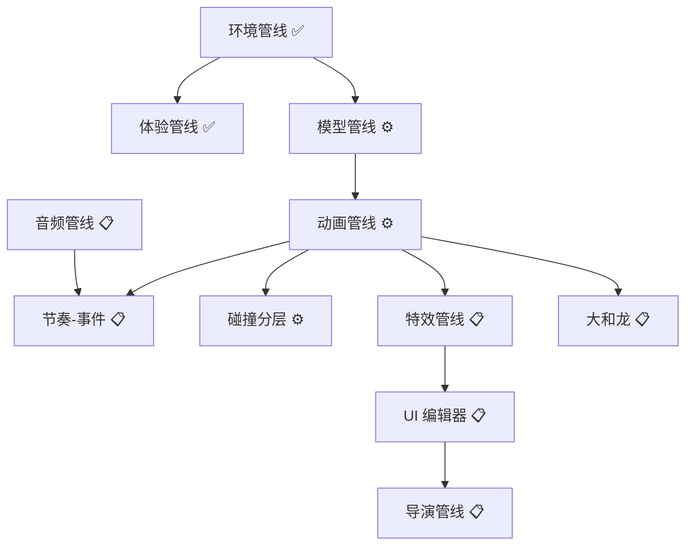
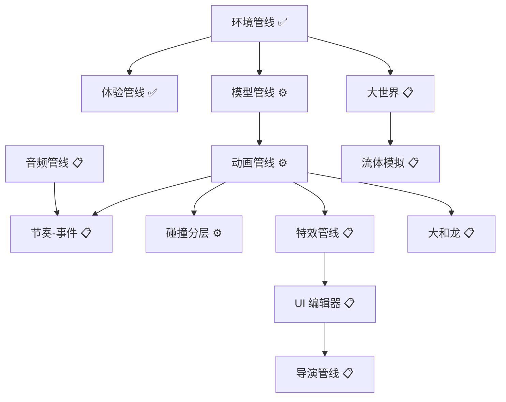
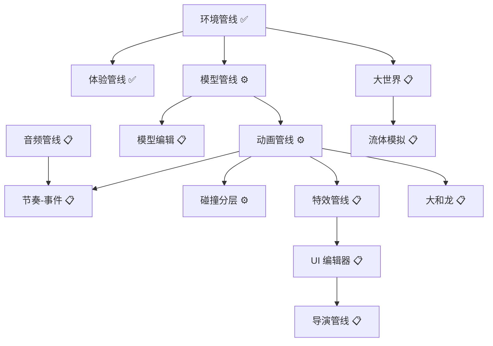

# 🛤️ PolyForge 资产管线与功能完成性路线图 (PIPELINE_ROADMAP.md)

> **"VISION.md 阐述为何前行，本文档规划如何抵达。"**
> 本文档是 VISION.md 的工程化落地指南，按资产类型与游戏功能模块拆解规划，为后续开发提供清晰的任务图谱。

---

## 第一部分：管线全景地图 (Pipeline Overview)

| 管线名称 | 状态 | 依赖 | 对应阶段 |
|---|---|---|---|
| **环境管线 (Environment)** | ✅ 已完成 | - | Phase 13-16 |
| **游戏体验管线 (Experience)** | ✅ 已完成 | 环境管线 | Phase 19-20 |
| **模型资产管线 (Model Asset)** | ⚙️ 部分完成 | 环境管线 | Phase 13+ |
| **动画管线 (Animation)** | ⚙️ 规划中 | 模型管线 | Phase 21 |
| **节奏-事件管线 (Rhythm-Event)** | 📋 待规划 | 动画+音频 | Phase 21.5 |
| **碰撞体分层管线 (Collision)** | ⚙️ 规划中 | 动画管线 | Phase 22 |
| **特效管线 (VFX)** | 📋 待规划 | 动画管线 | Phase 23 |
| **音频管线 (Audio)** | 📋 待规划 | - | Phase 24 |
| **UI 编辑器管线 (UI Editor)** | 📋 待规划 | - | Phase 25 |
| **旧版工坊打通 (大和龙)** | 📋 待规划 | 全部管线 | Phase 26 |
| **导演/影视管线 (Director)** | 📋 待规划 | UI + VFX | Phase 27 |
| **大世界渲染管线 (Large World)** | 📋 待规划 | 环境管线 | Phase 28 |
| **模型编辑管线 (Model Editing)** | 📋 待规划 | 模型管线 | Phase 29 |

---

## 第二部分：已完成管线概览

### 2.1 环境管线 (Environment Pipeline) ✅
**职责**：创造模式下的场景搭建能力。
- 地形生成与编辑 (TerrainSystem)
- 植被分布与参数化控制 (VegetationSystem)
- 模型资产导入与放置 (PlacementSystem)
- 图片资产三模态 (Sticker/Billboard/Standee)
- 物理碰撞盒编辑 (PhysicsComponent)
- HDR 环境贴图 (WorldStateManager)

### 2.2 游戏体验管线 (Experience Pipeline) ✅
**职责**：体验模式下的游戏玩法支撑。
- 四种相机预设 (ISO/TPS/FPS/Sidescroll)
- 角色生成与绑定 (spawnPlayerCharacter)
- 物理驱动角色控制 (WASD + Rapier)
- 相机碰撞检测 (仅 TPS)

### 2.3 模型资产管线 (Model Asset Pipeline) ⚙️ 部分完成
**已实现**：GLB 导入、骨骼检测、动画提取、放置与碰撞、阴影投射
**待实现**：LOD 自动生成、模型资产库 UI

---

## 第三部分：待开发管线详细规划

### 3.1 动画管线 (Phase 21)
| 子阶段 | 内容 | 复杂度 |
|---|---|---|
| 21.1 | `AnimationComponent` | ⭐ |
| 21.2 | `AnimationSystem` | ⭐⭐ |
| 21.3 | EngineBridge AnimationMixer 桥接 | ⭐⭐ |
| 21.4 | UI 动画选择器 | ⭐⭐ |
| 21.5 | 帧级事件系统 | ⭐⭐⭐ |
| 21.6 | 多生物骨骼 (人形/四足/多足) | ⭐⭐⭐⭐ |
| 21.7 | 程序化动画 Additive Layer | ⭐⭐⭐⭐ |

### 3.2 节奏-事件管线 (Phase 21.5)
- 动画帧事件触发
- RhythmClock (AudioWorklet 高精度时钟)
- BeatMap 节拍图数据结构
- 节拍编辑器 UI

### 3.3 碰撞体分层管线 (Phase 22)
| 层级 | 用途 | 形状 | 状态 |
|---|---|---|---|
| 粗检 | 快速排除 | AABB/BVH | ✅ 内置 |
| 运动碰撞 | 角色位移 | Capsule | ✅ 已实现 |
| 攻击判定 | 骨骼绑定 | Box/Sphere | 待开发 |
| 精确碰撞 | 特殊场景 | Convex/Trimesh | 待开发 |

### 3.4 旧版工坊打通 (大和龙 Phase 26)

| 模块 | 评估 | 理由 |
|---|---|---|
| 英雄大厅 | 🔄 桥接 | UI 复用，后端接入 VisualComponent |
| 装备库 | 🔄 桥接 | 迁移到 AssetRegistry |
| 动画工坊 | 🔄 桥接 | 输出适配 AnimationClip |
| 程序化参数 | 🔄 桥接 | Additive Layer 叠加 |
| 特效库 | ⚠️ 待评估 | 对比 VFX 方案 |
| 社道 | 🆕 重做 | PlacementSystem 更强大 |
| 镜头控制 | ✅ 已重做 | CameraPresetManager 覆盖 |

**程序化动画优先级**：Additive Blending（标准动画 + 程序化偏移）

---

## 第四部分：VFX 特效管线 (Phase 23)

### 技术选型
| 方案 | 适配度 |
|---|---|
| Points + PointsMaterial | ⭐⭐ |
| InstancedMesh 粒子 | ⭐⭐⭐⭐ |
| **自定义 GPU Particles** | ⭐⭐⭐⭐⭐ |

**推荐**：类 Godot 轻量 GPU 粒子 + 2D 序列帧双轨

### VFX 管线结构
```
VFX 管线
├── 3D 粒子轨道 (GPU Particles)
│   ├── ParticleEmitterComponent
│   ├── ParticleSystem
│   └── ParticleMaterial
└── 2D 序列帧轨道
    ├── SpriteSequenceComponent
    └── Billboard 渲染
```

---

## 第五部分：UI 编辑器管线 (Phase 25)

### 制作人愿景
- 独立模块、所见即所得
- 双重自定义（游戏 UI + 引擎 UI）
- 可拖拽布局、主题皮肤、素材热替换
- 功能直连（设计即绑定逻辑）

### 推荐架构
```
UI 编辑器架构
├── 1. 布局引擎 (Dockable Panels)
├── 2. 组件库 (Button/Slider/Panel/...)
├── 3. 主题引擎 (CSS Variables)
├── 4. 绑定系统 (UI ↔ WorldState)
└── 5. 可视化编辑器
```

### 分阶段实现
| 阶段 | 内容 | 时间 |
|---|---|---|
| A | Dockable Layout MVP | 2-3 周 |
| B | Theme Engine | 1-2 周 |
| C | Schema-Driven Components | 3-4 周 |
| D | Visual UI Editor | 4-6 周 |
| E | Binding System | 2-3 周 |
| F | Game HUD Builder | 4-6 周 |

**快速改善**：先实现 Dockable Layout (Phase 20+)，低成本高回报。

---

## 第六部分：缺失基础设施

| 系统 | 描述 | 优先级 |
|---|---|---|
| NavMesh/寻路 | AI 自动导航 | ⭐⭐⭐⭐ |
| 物理关节 | 门/铰链/布偶 | ⭐⭐⭐ |
| 场景管理 | 多场景切换 | ⭐⭐⭐ |
| 多语言 | 国际化支持 | ⭐⭐ |
| 联机/多人 | 网络同步 | ⭐⭐⭐⭐⭐ |

---

## 第七部分：开放问题解答

| 问题 | 决策 | 方案 |
|---|---|---|
| 动画事件系统 | ✅ 必须支持 | 节奏-事件管线 |
| 骨骼重定向 | ✅ 多生物支持 | 骨架模板系统 |
| 程序化优先级 | 第一性原理 | Additive Blending |
| 旧版数据迁移 | MVP 可舍弃 | 专注架构 |
| VFX 管线 | GPU 粒子 | 3D + 2D 双轨 |
| 装备系统 | 分层处理 | 资产层 + 机制层 |
| AI 高光录制 | 独立板块 | 导演管线 Phase 27+ |

---

## 第八部分：管线依赖关系图



## 第十部分：大世界渲染管线 (Phase 28) 📋 新增

### 10.1 当前能力 vs 3A 级需求

| 特性 | PolyForge 现状 | 3A 标准 (塞尔达/天际线) |
|---|---|---|
| 地形规模 | 数百米 | 数公里 |
| 大气透视 | ❌ 无 | ✅ Rayleigh/Mie 散射 |
| 距离雾 | ❌ 无 | ✅ 动态层级雾 |
| 地形 LOD | ❌ 无 | ✅ 多级精度 |
| Chunk 分块 | ❌ 无 | ✅ 动态加载卸载 |
| Billboard 远景 | ❌ 无 | ✅ 远处用 2D |
| GPU 实例化 | ✅ 植被系统 | ✅ 万级物体 |
| 遮挡剔除 | ⚙️ 基础 | ✅ 深度优化 |

### 10.2 大世界实现路线

| 优先级 | 任务 | 效果 | 工作量 |
|---|---|---|---|
| 1 | **大气散射 Shader** | 立即产生"大世界"感觉 | 1-2 周 |
| 2 | **距离雾 + 天空渐变** | 隐藏边界，提升氛围 | 几天 |
| 3 | **地形 Chunk 分块** | 支持更大地图 | 2-3 周 |
| 4 | **Billboard 远景** | 性能优化 | 1-2 周 |
| 5 | **程序化生态** | 自动森林/道路分布 | 3-4 周 |

### 10.3 技术可行性

**结论**：Three.js/WebGL 完全可以做到，瓶颈在实现，不在技术栈。

---

## 第十一部分：资产兼容性分析

### 11.1 外部资产导入

| 格式 | 状态 | 说明 |
|---|---|---|
| GLB/GLTF | ✅ 完成 | 模型+骨骼+动画 |
| PNG/JPG | ✅ 完成 | 贴图/贴纸 |
| HDR | ✅ 完成 | 环境贴图 |
| FBX | ❌ 未支持 | 需三方库 |
| OBJ | ⚙️ 可选 | Three.js 有 Loader |
| 音频 MP3/WAV | 📋 待规划 | 音频管线 |

### 11.2 内部资产导出

| 格式 | 状态 | 说明 |
|---|---|---|
| GLB | 📋 Phase 13.4 | 模型导出 |
| PFB Bundle | ✅ 完成 | 场景打包 |
| JSON 配置 | ✅ 完成 | WorldState |

### 11.3 待解决兼容性问题

- **LOD 自动生成**：高模导入后自动生成多级精度
- **骨骼重定向**：Mixamo → 自定义骨架映射
- **材质标准化**：PBR 材质统一管道

---

## 第十二部分：模拟建造能力分析 (Cities Skylines 2 对标)

### 12.1 功能对比

| 功能 | Cities Skylines 2 | PolyForge |
|---|---|---|
| 地形高低编辑 | ✅ 精细 Brush | ✅ 基础 (Raise/Lower) |
| 画笔工具 | ✅ 多种笔刷 | 📋 待规划 |
| 道路系统 | ✅ 样条曲线 | ❌ 未实现 |
| 水体/河流 | ✅ 水面 + 流动 | ❌ 未实现 |
| 流体模拟 | ⚠️ 有限 | ❌ 未实现 |
| 建筑放置 | ✅ 吸附网格 | ✅ 自由放置 |
| 大地图 | ✅ 分块加载 | ❌ 固定规模 |

### 12.2 流体模拟可行性分析

**问题**：能否在地面挖河道，引水，真实物理流体？

| 方案 | 技术路径 | 复杂度 | 性能 |
|---|---|---|---|
| **视觉流体** | Shader 动画水面 | ⭐⭐ | 极好 |
| **高度场流体** | 网格模拟水位扩散 | ⭐⭐⭐ | 较好 |
| **SPH 粒子** | 物理粒子模拟 | ⭐⭐⭐⭐⭐ | 差 (Web 受限) |
| **GPU 计算着色器** | WebGPU Compute | ⭐⭐⭐⭐ | 好 (新技术) |

**山神建议**：
- **短期**：Shader 水面 + 静态河道（视觉效果优先）
- **中期**：高度场流体模拟（教育向，水往低处流）
- **长期**：WebGPU 计算着色器（真实物理流体）

### 12.3 画笔工具规划

| 画笔类型 | 功能 | 状态 |
|---|---|---|
| 地形 Brush | 抬升/挖掘/平整 | ✅ 基础实现 |
| 植被 Brush | 绘制森林/草地 | 📋 待规划 |
| 道路 Brush | 绘制道路/河流曲线 | 📋 待规划 |
| 纹理 Brush | 地表材质混合 | 📋 待规划 |
| 水体 Brush | 填充低洼形成湖泊 | 📋 待规划 |

---

## 第十三部分：教育与愿景价值

### 制作人愿景 (2026-01-03)
> "让小朋友直观学习世界原理，让大朋友构建庞大游戏世界。"

### 教育功能规划

| 功能 | 教育价值 | 实现路径 |
|---|---|---|
| 水往低处流 | 物理直觉 | 高度场流体 |
| 日夜交替 | 天文基础 | 光照系统 |
| 植被生长 | 生态系统 | 程序化动画 |
| 物体碰撞 | 牛顿力学 | Rapier 刚体 |
| 重力调节 | 物理实验 | ✅ 已实现 |

---

## 第十四部分：管线依赖关系图 (更新版)



---

## 第十六部分：模型编辑管线 (Phase 29) 📋 新增

### 16.1 旧版模型工坊能力

| 功能 | 状态 | 说明 |
|---|---|---|
| 基础几何体 | ✅ 有 | Box/Sphere/Cylinder 等 |
| 层级树管理 | ✅ 有 | 父子关系 |
| 变换操作 | ✅ 有 | 位移/旋转/缩放 |
| 材质/颜色 | ✅ 有 | 基础着色 |
| 顶点编辑 | ❌ 无 | 无法修改单个顶点 |
| 雕刻工具 | ❌ 无 | 无笔刷变形 |
| 布尔运算 | ❌ 无 | 无合并/相减 |
| 网格清理 | ❌ 无 | 无内面删除/补洞 |
| 减面封装 | ❌ 无 | 无一键打包 |

### 16.2 对比专业软件 (Blender/ZBrush)

| 功能 | Blender | ZBrush | PolyForge (目标) |
|---|---|---|---|
| 基础建模 | ✅ | ✅ | ✅ 有 (旧版) |
| 顶点级编辑 | ✅ | ✅ | ⚠️ 待做 |
| 雕刻笔刷 | ✅ | ✅✅✅ | 📋 待规划 |
| 布尔运算 | ✅ | ❌ | 📋 待规划 |
| 减面 | ✅ | ✅ | 📋 待规划 |
| UV 编辑 | ✅✅✅ | ✅ | ❌ 不做 |

### 16.3 实现路线

| 子阶段 | 内容 | 复杂度 | 工作量 |
|---|---|---|---|
| **29.1** | 布尔运算集成 (three-bvh-csg) | ⭐⭐⭐ | 1-2 周 |
| **29.2** | 合并选中物体 + 删内面 | ⭐⭐ | 几天 |
| **29.3** | 减面工具 (SimplifyModifier) | ⭐⭐ | 1 周 |
| **29.4** | 一键封装导出 GLB | ⭐⭐ | 几天 |
| **29.5** | 模型雕刻笔刷 (基础) | ⭐⭐⭐⭐ | 2-3 周 |
| **29.6** | 补洞/修复工具 | ⭐⭐⭐⭐⭐ | 3-4 周 |

### 16.4 技术方案

| 功能 | 推荐库/技术 |
|---|---|
| 布尔运算 | `three-bvh-csg` (MIT, 高性能) |
| 减面 | `meshoptimizer` (WASM) |
| 雕刻 | 复用地形 Brush 架构 |
| 合并 | `BufferGeometryUtils.mergeBufferGeometries` |

---

## 第十七部分：管线依赖关系图 (更新版 v0.7.0)



---

## 第十八部分：文档体系规划

| 文档 | 职责 | 状态 |
|---|---|---|
| **VISION.md** | 最高愿景与设计哲学 | ✅ |
| **PIPELINE_ROADMAP.md** | 资产创作与内容管线 | ✅ 当前 |
| **GAMEPLAY_SYSTEMS_ROADMAP.md** | 游戏机制与逻辑系统 | 📋 待创建 |
| **DIRECTOR_PIPELINE_ROADMAP.md** | 影视/录制/剪辑 | 📋 可选 |

---

**签署人**：山神 (Mountain God)
**创建日期**：2026-01-03
**最后更新**：2026-01-03 (v0.7.0 - 新增模型编辑管线)
