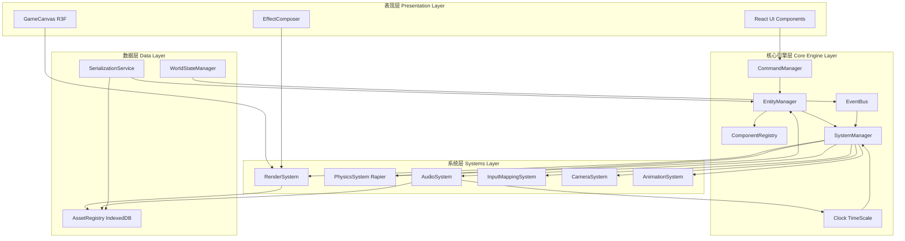

# PolyForge v1.3.0 核心架构设计文档

## 概述

PolyForge v1.3.0 是一次全面的架构重构，将现有的游戏编辑器升级为一个高度可扩展、数据驱动的游戏引擎。本设计采用 ECS（Entity-Component-System）架构模式作为核心，配合命令模式、事件总线、资产管线等现代游戏引擎设计理念，实现模块间的高度解耦和灵活扩展。

### 核心设计原则

1. **数据驱动**：所有游戏逻辑通过数据配置而非硬编码实现
2. **组件化**：功能通过可组合的组件实现，避免继承层级
3. **可序列化**：所有状态可完整序列化为 JSON，支持存档和网络同步
4. **本地优先**：完全本地化运行，零外部依赖
5. **MOD 友好**：支持运行时动态加载和卸载扩展内容

## 架构

### 整体架构图



### 数据流向

1. **输入流**：用户输入 → InputMappingSystem → Command → EntityManager → Component 更新
2. **更新流**：Clock.tick() → SystemManager.update() → 各 System 处理对应 Component
3. **渲染流**：RenderSystem 收集 VisualComponent → R3F 渲染 → EffectComposer 后期
4. **事件流**：System 触发事件 → EventBus 广播 → 订阅者响应

## 组件与接口

### 核心接口定义

#### Entity 接口

```typescript
interface Entity {
  id: string;                          // 唯一标识符
  name: string;                        // 可读名称
  components: Map<string, Component>;  // 组件映射
  parent?: Entity;                     // 父实体（用于层级）
  children: Entity[];                  // 子实体列表
  sockets: Map<string, Socket>;        // 挂点定义
  active: boolean;                     // 激活状态
}
```

#### Component 基类

```typescript
interface Component {
  type: string;                        // 组件类型标识
  enabled: boolean;                    // 启用状态
  serialize(): ComponentData;          // 序列化
  deserialize(data: ComponentData): void; // 反序列化
}
```

#### System 基类

```typescript
interface System {
  priority: number;                    // 执行优先级
  requiredComponents: string[];        // 需要的组件类型
  update(deltaTime: number, entities: Entity[]): void; // 更新逻辑
  onEntityAdded(entity: Entity): void;    // 实体添加回调
  onEntityRemoved(entity: Entity): void;  // 实体移除回调
}
```

### 组件类型详细设计

#### VisualComponent（视觉组件）

```typescript
interface VisualComponent extends Component {
  type: 'Visual';
  mesh: {
    geometry: GeometryData;            // 几何体数据
    material: MaterialData;            // 材质数据
  };
  emissive: {
    color: string;                     // 自发光颜色
    intensity: number;                 // 发光强度
  };
  postProcessing: {
    bloom: boolean;                    // 是否参与辉光
    outline: boolean;                  // 是否显示轮廓
  };
  castShadow: boolean;
  receiveShadow: boolean;
  visible: boolean;
}
```

#### RigComponent（骨骼组件）

```typescript
type RigType = 'humanoid' | 'multiped' | 'custom';

interface BoneDefinition {
  name: string;
  parent?: string;
  position: [number, number, number];
  rotation: [number, number, number];
}

interface RigComponent extends Component {
  type: 'Rig';
  rigType: RigType;
  bones: Map<string, BoneDefinition>;  // 骨骼树
  ikChains?: IKChain[];                // IK 链（可选）
  constraints?: BoneConstraint[];      // 骨骼约束
}
```

#### PhysicsComponent（物理组件）

```typescript
interface PhysicsComponent extends Component {
  type: 'Physics';
  bodyType: 'static' | 'dynamic' | 'kinematic';
  collider: {
    shape: 'box' | 'sphere' | 'capsule' | 'mesh';
    size: [number, number, number];
    offset: [number, number, number];
  };
  mass: number;
  friction: number;
  restitution: number;                 // 弹性系数
  rapierHandle?: number;               // Rapier 内部句柄
}
```

#### VehicleComponent（载具组件）

```typescript
interface VehicleComponent extends Component {
  type: 'Vehicle';
  wheelSockets: string[];              // 轮子挂点名称
  enginePower: number;
  maxSpeed: number;
  steering: {
    maxAngle: number;
    speed: number;
  };
  suspension: {
    stiffness: number;
    damping: number;
    travel: number;
  };
}
```

#### TransformComponent（变换组件）

```typescript
interface TransformComponent extends Component {
  type: 'Transform';
  position: [number, number, number];
  rotation: [number, number, number];  // Euler angles
  scale: [number, number, number];
  worldMatrix?: Matrix4;               // 缓存的世界矩阵
}
```

#### AudioSourceComponent（音频源组件）

```typescript
interface AudioSourceComponent extends Component {
  type: 'AudioSource';
  assetId: string;                     // 音频资产 ID
  volume: number;
  pitch: number;
  loop: boolean;
  spatial: boolean;                    // 是否为 3D 音效
  maxDistance: number;
  rolloffFactor: number;
  autoPlay: boolean;
}
```

### Socket/Anchor 系统

#### Socket 定义

```typescript
interface Socket {
  name: string;                        // 挂点名称（如 'hand_right', 'weapon_mount'）
  localTransform: {
    position: [number, number, number];
    rotation: [number, number, number];
    scale: [number, number, number];
  };
  allowedTypes?: string[];             // 允许附加的实体类型（可选）
  occupied?: Entity;                   // 当前附加的实体
}
```

#### 挂点操作

```typescript
interface SocketOperations {
  // 附加实体到挂点
  attach(entity: Entity, socketName: string, parent: Entity): void;
  
  // 从挂点分离实体
  detach(entity: Entity): void;
  
  // 查询挂点状态
  isOccupied(parent: Entity, socketName: string): boolean;
  
  // 获取挂点世界坐标
  getSocketWorldTransform(parent: Entity, socketName: string): Transform;
}
```

## 数据模型

### EntityManager 数据结构

```typescript
class EntityManager {
  private entities: Map<string, Entity>;
  private componentIndex: Map<string, Set<string>>; // componentType -> entityIds
  private hierarchyRoot: Entity[];                  // 根实体列表
  
  createEntity(name: string): Entity;
  destroyEntity(id: string): void;
  addComponent(entityId: string, component: Component): void;
  removeComponent(entityId: string, componentType: string): void;
  getEntitiesWithComponents(types: string[]): Entity[];
  
  // 层级管理
  setParent(childId: string, parentId: string, socketName?: string): void;
  removeParent(childId: string): void;
  getChildren(parentId: string): Entity[];
}
```

### AssetRegistry 数据结构

```typescript
interface AssetMetadata {
  id: string;
  name: string;
  type: 'model' | 'audio' | 'texture' | 'hdr';
  category: string;
  tags: string[];
  size: number;
  createdAt: number;
  thumbnail?: string;                  // Base64 缩略图
}

class AssetRegistry {
  private db: IDBDatabase;
  private cache: Map<string, any>;
  
  async importModel(file: File, compress: boolean): Promise<string>;
  async importAudio(file: File): Promise<string>;
  async importHDR(file: File): Promise<string>;
  async getAsset(id: string): Promise<any>;
  async deleteAsset(id: string): Promise<void>;
  async queryAssets(filter: AssetFilter): Promise<AssetMetadata[]>;
}
```

### CommandManager 数据结构

```typescript
interface Command {
  id: string;
  type: string;
  timestamp: number;
  execute(): void;
  undo(): void;
  redo(): void;
  serialize(): CommandData;
}

class CommandManager {
  private undoStack: Command[];
  private redoStack: Command[];
  private maxStackSize: number = 100;
  
  execute(command: Command): void;
  undo(): void;
  redo(): void;
  canUndo(): boolean;
  canRedo(): boolean;
  clear(): void;
}
```

### Clock 时钟系统

```typescript
class Clock {
  private startTime: number;
  private currentTime: number;
  private deltaTime: number;
  private timeScale: number = 1.0;
  private paused: boolean = false;
  
  tick(): void;
  setTimeScale(scale: number): void;
  pause(): void;
  resume(): void;
  getDeltaTime(): number;
  getElapsedTime(): number;
}
```

### WorldStateManager

```typescript
interface WorldState {
  time: {
    hour: number;                      // 0-24
    dayProgress: number;               // 0-1
    timeSpeed: number;                 // 时间流速倍率
  };
  weather: {
    type: 'clear' | 'rain' | 'snow' | 'fog';
    intensity: number;                 // 0-1
    windDirection: [number, number];
    windSpeed: number;
  };
  lighting: {
    sunDirection: [number, number, number];
    sunColor: string;
    sunIntensity: number;
    ambientColor: string;
    ambientIntensity: number;
  };
}

class WorldStateManager {
  private state: WorldState;
  private eventBus: EventBus;
  
  setState(partial: Partial<WorldState>): void;
  getState(): WorldState;
  update(deltaTime: number): void;     // 更新昼夜循环等
}
```

### InputMappingSystem

```typescript
interface InputAction {
  name: string;
  keys: string[];                      // 键位绑定
  mouseButtons?: number[];
  modifiers?: ('ctrl' | 'shift' | 'alt')[];
}

interface InputPreset {
  name: string;                        // 'blender' | 'game' | 'custom'
  actions: Map<string, InputAction>;
}

class InputMappingSystem implements System {
  private currentPreset: InputPreset;
  private presets: Map<string, InputPreset>;
  private contextStack: string[];      // 上下文栈（用于解决冲突）
  
  setPreset(name: string): void;
  bindAction(actionName: string, keys: string[]): void;
  isActionPressed(actionName: string): boolean;
  pushContext(context: string): void;  // 进入新上下文（如打开面板）
  popContext(): void;                  // 退出上下文
}
```

### CameraSystem

```typescript
type CameraMode = 'FPS' | 'TPS' | 'ARPG' | 'Sidescroll';

interface CameraPreset {
  mode: CameraMode;
  offset: [number, number, number];    // 相对目标的偏移
  fov: number;
  near: number;
  far: number;
  constraints?: {
    minDistance?: number;
    maxDistance?: number;
    minPitch?: number;
    maxPitch?: number;
  };
}

class CameraSystem implements System {
  private currentMode: CameraMode;
  private target: Entity;              // 跟随目标
  private presets: Map<CameraMode, CameraPreset>;
  private transitionProgress: number;  // 0-1 切换进度
  
  setMode(mode: CameraMode, smooth: boolean): void;
  setTarget(entity: Entity): void;
  update(deltaTime: number): void;
}
```

### PhysicsSystem（Rapier 集成）

```typescript
class PhysicsSystem implements System {
  private world: RAPIER.World;
  private characterController: RAPIER.KinematicCharacterController;
  private bodyMap: Map<string, RAPIER.RigidBody>; // entityId -> RigidBody
  
  initialize(): void;
  update(deltaTime: number, entities: Entity[]): void;
  
  // 角色控制器
  moveCharacter(entity: Entity, direction: [number, number, number]): void;
  
  // 斜坡和台阶处理
  private handleSlope(body: RAPIER.RigidBody, normal: [number, number, number]): void;
  private handleStep(body: RAPIER.RigidBody, height: number): void;
}
```

### AudioSystem

```typescript
interface BPMConfig {
  bpm: number;
  beatsPerBar: number;
  judgeWindow: number;                 // 判定窗口（秒）
}

class AudioSystem implements System {
  private audioContext: AudioContext;
  private sources: Map<string, AudioBufferSourceNode>;
  private clock: Clock;
  private bpmConfig?: BPMConfig;
  private beatCallbacks: Set<(beatIndex: number) => void>;
  
  update(deltaTime: number, entities: Entity[]): void;
  
  // BPM 相关
  setBPM(config: BPMConfig): void;
  onBeat(callback: (beatIndex: number) => void): void;
  
  // 时间缩放联动
  private updatePlaybackRate(): void;  // 根据 Clock.timeScale 调整
}
```

### SerializationService

```typescript
interface SerializedWorld {
  version: string;
  timestamp: number;
  entities: SerializedEntity[];
  worldState: WorldState;
  assetReferences: string[];           // 使用的资产 ID 列表
}

class SerializationService {
  serialize(entityManager: EntityManager, worldState: WorldState): SerializedWorld;
  deserialize(data: SerializedWorld): void;
  
  // Standalone Bundle 导出
  async exportBundle(outputPath: string): Promise<void>;
  async importBundle(bundlePath: string): Promise<void>;
}
```

## 正确性属性


*属性是一个特征或行为，应该在系统的所有有效执行中保持为真——本质上是关于系统应该做什么的形式化陈述。属性作为人类可读规范和机器可验证正确性保证之间的桥梁。*

### 属性 1：Entity 生命周期一致性
*对于任何* Entity，当创建时必须分配唯一 ID，当销毁时必须从 EntityManager 中完全移除且所有引用被清理
**验证：需求 1.1, 1.2**

### 属性 2：组件序列化往返一致性
*对于任何* Component，序列化后再反序列化应该产生等价的组件状态
**验证：需求 1.4, 1.5**

### 属性 3：Socket 层级传播
*对于任何* 父 Entity 的变换更新，所有通过 Socket 附加的子 Entity 的世界坐标必须相应更新
**验证：需求 3.3**

### 属性 4：TimeScale 音频同步
*对于任何* TimeScale 值的改变，所有正在播放的音频的播放速率必须按相同比例调整
**验证：需求 12.1**

### 属性 5：Command 可逆性
*对于任何* Command，执行 execute() 后执行 undo() 必须恢复到执行前的状态
**验证：需求 5.2, 5.3**

### 属性 6：物理同步一致性
*对于任何* 带有 PhysicsComponent 的 Entity，其 TransformComponent 必须与 Rapier 刚体的位置保持同步
**验证：需求 13.6**

### 属性 7：资产引用完整性
*对于任何* 导出的 Standalone Bundle，所有被 Entity 引用的资产必须包含在数据包中
**验证：需求 14.2**

### 属性 8：相机模式切换平滑性
*对于任何* 相机模式切换，过渡时间必须在 1 秒内完成且无突变
**验证：需求 15.2**

### 属性 9：输入上下文隔离
*对于任何* 输入事件，只有当前上下文栈顶的绑定应该被触发
**验证：需求 4.3**

### 属性 10：MOD 动态加载隔离性
*对于任何* MOD 的加载和卸载，不应影响其他 MOD 或核心系统的运行状态
**验证：需求 16.3, 16.4**

## 错误处理

### 组件错误处理
- 组件反序列化失败时，记录错误并跳过该组件，不中断整个 Entity 加载
- 组件类型未注册时，保留原始 JSON 数据以便后续恢复

### 物理系统错误处理
- Rapier World 初始化失败时，降级为纯视觉模式
- 角色控制器碰撞检测失败时，使用上一帧的有效位置

### 资产加载错误处理
- 资产加载失败时，使用占位符资产（如粉色方块）
- IndexedDB 不可用时，降级为内存存储并警告用户

### 命令系统错误处理
- Command 执行失败时，自动回滚并从栈中移除
- 撤销栈损坏时，清空栈并通知用户

### 音频系统错误处理
- AudioContext 创建失败时，静默运行并禁用音频功能
- 音频文件解码失败时，跳过该音频源

## 测试策略

### 单元测试
- EntityManager 的 CRUD 操作
- Component 的序列化/反序列化
- CommandManager 的撤销/重做逻辑
- Socket 系统的附加/分离操作
- InputMappingSystem 的键位冲突解决

### 集成测试
- ECS 系统间的协作（如 PhysicsSystem 更新 TransformComponent）
- 资产导入导出流程
- Standalone Bundle 的打包和加载
- 相机模式切换的平滑性

### 性能测试
- 10000 个 Entity 的更新性能
- 大型场景的序列化/反序列化时间
- IndexedDB 的读写吞吐量
- Rapier 物理模拟的帧率影响
