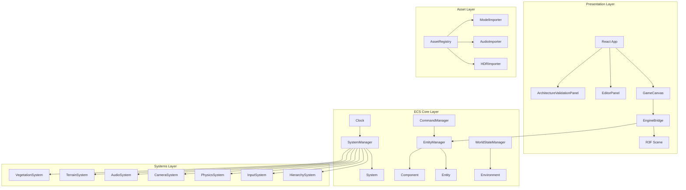

# PolyForge v1.3.0 核心架构 - 统一设计文档

**版本**: v1.3.0  
**最后更新**: 2025-12-23  
**状态**: 15/17 阶段完成 (88.2%)

---

## 概述

PolyForge v1.3.0 是一个基于 ECS（Entity-Component-System）架构的高性能游戏引擎。本设计文档描述了从 Phase 1 到 Phase 17 的完整技术实现方案。

### 核心设计原则

1. **影子构建策略**: 所有新代码在 `src/core/` 目录，不影响现有代码
2. **组件化设计**: 高内聚、低耦合
3. **类型安全**: TypeScript 严格模式，零告警
4. **测试驱动**: 完整的单元测试和演示场景
5. **性能优先**: O(1) 组件查询，脏标记优化

---

## 架构

### 系统架构图



### 技术栈

- **前端框架**: React 19.2.0
- **3D 渲染**: Three.js 0.181.2, @react-three/fiber 9.4.0, @react-three/drei 10.7.7
- **构建工具**: Vite 6.2.0
- **类型系统**: TypeScript 5.8.2
- **物理引擎**: Rapier 3D
- **音频引擎**: Web Audio API
- **测试框架**: Vitest

---

## 核心模块设计

### 1. ECS 核心（Phase 1）

**EntityManager**:
```typescript
class EntityManager {
  private entities: Map<string, Entity>;
  private componentsByType: Map<string, Map<string, Component>>;
  
  createEntity(name?: string): string;
  deleteEntity(entityId: string): void;
  addComponent(entityId: string, component: Component): void;
  removeComponent(entityId: string, componentType: string): void;
  getComponent<T extends Component>(entityId: string, type: string): T | null;
  getEntitiesWithComponent(componentType: string): string[];
}
```

**SystemManager**:
```typescript
class SystemManager {
  private systems: System[];
  private clock: Clock;
  
  registerSystem(system: System, priority: number): void;
  update(): void;
  getSystem<T extends System>(type: string): T | null;
}
```

### 2. 层级系统（Phase 3）

**TransformComponent**:
```typescript
interface TransformComponent extends Component {
  position: Vector3;
  rotation: Quaternion;
  scale: Vector3;
  localMatrix: Matrix4;
  worldMatrix: Matrix4;
  isDirty: boolean;
  parent: string | null;
  children: string[];
  sockets: Map<string, Socket>;
}
```

**HierarchySystem**:
```typescript
class HierarchySystem extends System {
  update(deltaTime: number): void {
    // 1. 深度排序
    // 2. 更新世界矩阵
    // 3. 传播变换
  }
}
```

### 3. 时钟系统（Phase 4）

**Clock**:
```typescript
class Clock {
  private timeScale: number = 1.0;
  private isPaused: boolean = false;
  private deltaTime: number = 0;
  private elapsedTime: number = 0;
  
  tick(): void;
  pause(): void;
  resume(): void;
  setTimeScale(scale: number): void;
  getFPS(): number;
}
```

### 4. 命令系统（Phase 5）

**CommandManager**:
```typescript
class CommandManager {
  private undoStack: Command[] = [];
  private redoStack: Command[] = [];
  
  execute(command: Command): void;
  undo(): void;
  redo(): void;
  clear(): void;
}
```

### 5. 输入系统（Phase 6）

**InputSystem**:
```typescript
class InputSystem extends System {
  private keyMap: Map<string, InputAction>;
  private contextStack: InputContext[];
  
  registerAction(key: string, action: InputAction): void;
  pushContext(context: InputContext): void;
  popContext(): void;
}
```

### 6. 资产系统（Phase 7）

**AssetRegistry**:
```typescript
class AssetRegistry {
  private assets: Map<string, Asset>;
  private cache: Map<string, any>;
  
  async importModel(file: File): Promise<string>;
  async importAudio(file: File): Promise<string>;
  async importHDR(file: File): Promise<string>;
  getAsset(uuid: string): Asset | null;
}
```

### 7. 物理系统（Phase 8）

**PhysicsSystem**:
```typescript
class PhysicsSystem extends System {
  private world: RAPIER.World;
  private rigidBodies: Map<string, RAPIER.RigidBody>;
  
  update(deltaTime: number): void {
    // 1. 更新物理世界
    // 2. 同步 Transform
  }
}
```

### 8. 音频系统（Phase 9）

**AudioSystem**:
```typescript
class AudioSystem extends System {
  private audioContext: AudioContext;
  private listener: AudioListener;
  private sources: Map<string, AudioBufferSourceNode>;
  
  update(deltaTime: number): void {
    // 1. 更新 Listener 位置
    // 2. 更新音源位置
    // 3. 应用 TimeScale
  }
}
```

### 9. 相机系统（Phase 10）

**CameraSystem**:
```typescript
class CameraSystem extends System {
  private activeCamera: string | null;
  
  update(deltaTime: number): void {
    // 1. 更新相机位置
    // 2. 平滑插值
    // 3. 跟随目标
  }
}
```

**CameraComponent**:
```typescript
interface CameraComponent extends Component {
  mode: 'orbit' | 'firstPerson' | 'thirdPerson' | 'isometric' | 'sidescroll';
  target: string | null;
  distance: number;
  pitch: number;
  yaw: number;
  fov: number;
  near: number;
  far: number;
}
```

### 10. 环境管理（Phase 11）

**WorldStateManager**:
```typescript
class WorldStateManager {
  private timeOfDay: number = 12.0;
  private dayDuration: number = 60.0;
  private isDayNightCycleEnabled: boolean = false;
  
  update(deltaTime: number): void;
  setTimeOfDay(hour: number): void;
  getLightIntensity(): number;
  getColorTemperature(): number;
}
```

### 11. 地形系统（Phase 11.2）

**TerrainSystem**:
```typescript
class TerrainSystem extends System {
  modifyHeight(worldX: number, worldZ: number, delta: number, brush: Brush): void;
  raycastTerrain(origin: Vector3, direction: Vector3): RaycastHit | null;
  resetTerrain(): void;
  generateRandomTerrain(amplitude: number): void;
}
```

**TerrainComponent**:
```typescript
interface TerrainComponent extends Component {
  width: number;
  height: number;
  segmentsX: number;
  segmentsZ: number;
  heightMap: Float32Array;
}
```

### 12. 植被系统（Phase 11.3）

**VegetationSystem**:
```typescript
class VegetationSystem extends System {
  spawnVegetation(terrainEntity: string, density: number, type: VegetationType): void;
  clearVegetation(entityId: string): void;
  update(deltaTime: number): void {
    // 1. 更新风场
    // 2. 更新实例矩阵
  }
}
```

**VegetationComponent**:
```typescript
interface VegetationComponent extends Component {
  type: 'grass' | 'flower' | 'tree';
  density: number;
  seed: number;
  instances: InstanceData[];
}
```

### 13. 渲染系统（Phase 12）

**EngineBridge**:
```typescript
class EngineBridge {
  private entityManager: EntityManager;
  private worldStateManager: WorldStateManager;
  private terrainSystem: TerrainSystem | null;
  private vegetationSystem: VegetationSystem | null;
  
  render(): JSX.Element {
    // 1. 遍历所有实体
    // 2. 渲染 Visual 组件
    // 3. 渲染 Terrain 组件
    // 4. 渲染 Vegetation 组件
    // 5. 应用后期处理
  }
}
```

**PostProcessing**:
```typescript
interface PostProcessingProps {
  bloomEnabled: boolean;
  bloomStrength: number;
  bloomThreshold: number;
  smaaEnabled: boolean;
}
```

### 14. 架构验证视图（Phase 14）

**ArchitectureValidationManager**:
```typescript
class ArchitectureValidationManager {
  private entityManager: EntityManager;
  private systemManager: SystemManager;
  private worldStateManager: WorldStateManager;
  private clock: Clock;
  
  start(): void {
    // 1. 初始化 ECS 核心
    // 2. 创建地形实体
    // 3. 创建上帝视角相机
  }
  
  update(): void {
    // 1. 更新时钟
    // 2. 更新系统
  }
  
  spawnVegetation(density: number): string | null;
  createMountain(): void;
  createValley(): void;
  setSunsetTime(): void;
  getStats(): Stats;
}
```

**ArchitectureValidationPanel**:
```typescript
interface ArchitectureValidationPanelProps {
  manager: ArchitectureValidationManager | null;
}

// 核心功能：
// 1. 实时 FPS 统计（useRef 直接操作 DOM）
// 2. 实体数/顶点数/植被数统计
// 3. 控制按钮（生成草地、创建山峰、创建山谷）
// 4. 一键演示（山峰 + 植被 + 日落）
```

### 15. GLB 导出服务（Phase 13 - 整合自 v1.1.0）

**ModelExportService**:
```typescript
class ModelExportService {
  private exporter: GLTFExporter;
  private readonly MAX_FILE_SIZE = 10 * 1024 * 1024; // 10MB
  
  async exportToGLB(
    sceneOrObject: THREE.Object3D,
    options: ExportOptions = {}
  ): Promise<ExportResult>;
  
  downloadGLB(data: ArrayBuffer, filename: string): void;
  generateFilename(modelName: string): string;
}
```

---

## 数据模型

### Entity 数据结构

```typescript
interface Entity {
  id: string;
  name: string;
  components: Map<string, Component>;
  parent: string | null;
  children: string[];
}
```

### Component 数据结构

```typescript
interface Component {
  type: string;
  entityId: string;
  serialize(): object;
  deserialize(data: object): void;
}
```

### System 数据结构

```typescript
abstract class System {
  protected entityManager: EntityManager;
  protected priority: number;
  
  abstract update(deltaTime: number): void;
  onEntityAdded?(entityId: string): void;
  onEntityRemoved?(entityId: string): void;
}
```

---

## 性能优化策略

### 1. 组件查询优化

- 使用 `Map<componentType, Map<entityId, component>>` 实现 O(1) 查询
- 避免遍历所有实体

### 2. 脏标记优化

- TransformComponent 使用 `isDirty` 标记
- 仅更新变化的变换矩阵

### 3. GPU Instancing

- VegetationSystem 使用 InstancedMesh
- 支持 10000+ 实例

### 4. 内存管理

- 对象池（AudioSystem 音源节点池）
- 及时清理（URL.revokeObjectURL）

### 5. React 优化

- React.memo 避免不必要的重渲染
- useRef 直接操作 DOM（FPS 统计）

---

## 错误处理

### 1. ECS 错误

- 实体不存在 → 返回 null
- 组件不存在 → 返回 null
- 系统错误 → 记录日志并继续

### 2. 资产加载错误

- 文件格式不支持 → 显示错误提示
- 加载失败 → 重试 3 次
- 超时 → 取消加载

### 3. 物理错误

- 刚体创建失败 → 记录日志
- 碰撞检测错误 → 忽略

### 4. 渲染错误

- 几何体无效 → 跳过渲染
- 材质错误 → 使用默认材质

---

## 测试策略

### 单元测试

- EntityManager.test.ts
- Hierarchy.test.ts
- Clock.test.ts
- Command.test.ts
- AssetPipeline.test.ts

### 集成测试

- 完整的 ECS 更新循环
- 资产导入和加载
- 物理同步
- 音频播放

### 性能测试

- FPS ≥ 60（5000 棵草 + 10000 顶点地形）
- 内存占用 < 500MB
- 首屏加载 < 3 秒

---

## 部署策略

### Cloudflare Pages 部署（整合自 v1.1.0）

**GitHub Actions 工作流**:
```yaml
name: Deploy to Cloudflare Pages

on:
  push:
    branches: [main]

jobs:
  deploy:
    runs-on: ubuntu-latest
    steps:
      - uses: actions/checkout@v4
      - uses: actions/setup-node@v4
      - run: npm ci
      - run: npm run build
      - uses: cloudflare/pages-action@v1
        with:
          apiToken: ${{ secrets.CLOUDFLARE_API_TOKEN }}
          accountId: ${{ secrets.CLOUDFLARE_ACCOUNT_ID }}
          projectName: low3d-editor
          directory: dist
```

---

## 附录

### 文件结构

```
src/core/
├── types.ts
├── Entity.ts
├── EntityManager.ts
├── SystemManager.ts
├── SerializationService.ts
├── Clock.ts
├── CommandManager.ts
├── WorldStateManager.ts
├── ArchitectureValidationManager.ts
├── components/
│   ├── TransformComponent.ts
│   ├── VisualComponent.ts
│   ├── PhysicsComponent.ts
│   ├── CameraComponent.ts
│   ├── AudioSourceComponent.ts
│   ├── TerrainComponent.ts
│   └── VegetationComponent.ts
├── systems/
│   ├── HierarchySystem.ts
│   ├── InputSystem.ts
│   ├── PhysicsSystem.ts
│   ├── CameraSystem.ts
│   ├── AudioSystem.ts
│   ├── TerrainSystem.ts
│   └── VegetationSystem.ts
└── assets/
    ├── AssetRegistry.ts
    ├── ModelImporter.ts
    ├── AudioImporter.ts
    └── HDRImporter.ts
```

---

**制作人**: _YUSHAN_  
**最后审计**: 2025-12-23
