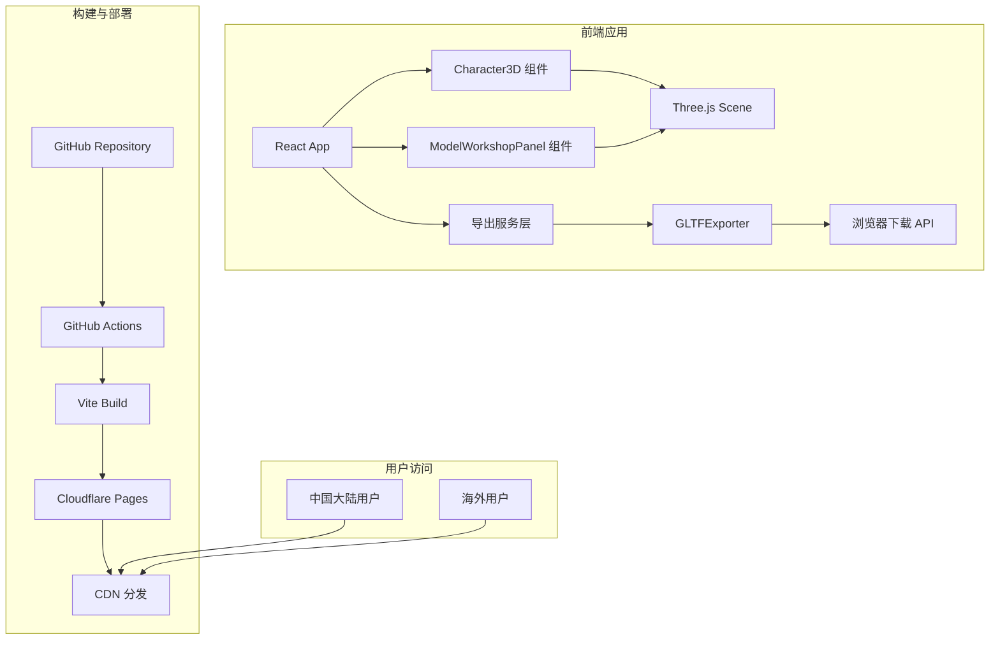
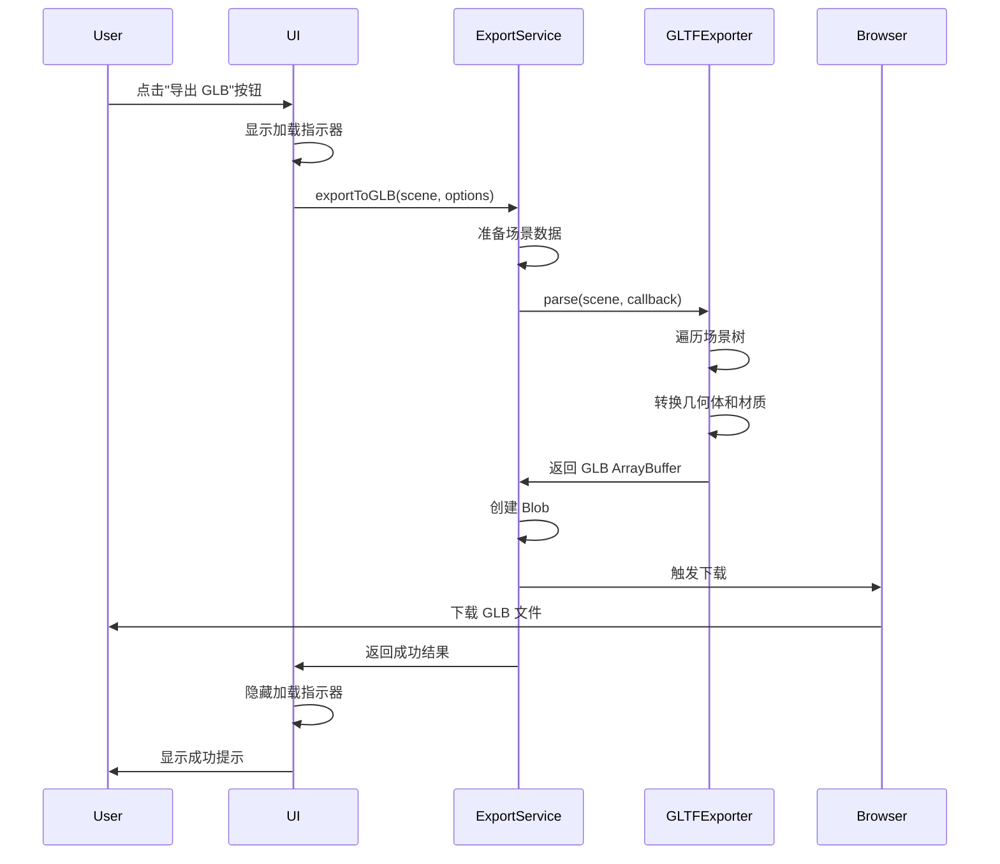
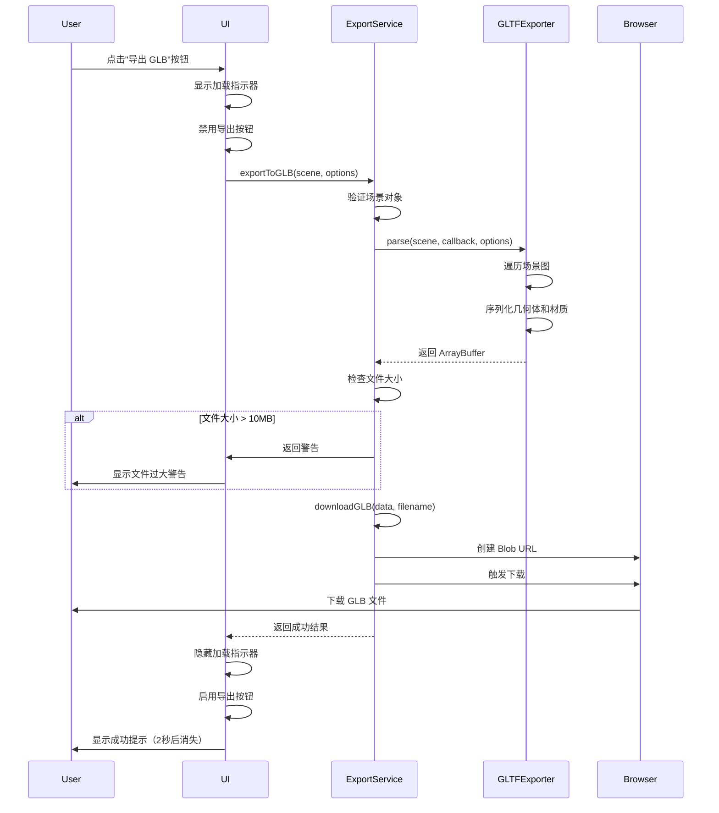

# 设计文档

## 概述

本设计文档描述了 LOW3D 游戏模拟编辑器 V1.1.0 版本的技术实现方案。该版本包含两个主要功能模块：

1. **Cloudflare Pages 部署迁移**：从 Vercel 迁移到 Cloudflare Pages，解决中国大陆访问问题
2. **GLB 模型导出功能**：实现 3D 模型的 GLB 格式导出，支持在外部工具中使用

本设计基于现有的 React + Three.js + Vite 技术栈，采用渐进式增强的方式实现新功能，确保不影响现有功能的稳定性。

## 架构

### 系统架构图



### 技术栈

- **前端框架**: React 19.2.0
- **3D 渲染**: Three.js 0.181.2, @react-three/fiber 9.4.0, @react-three/drei 10.7.7
- **构建工具**: Vite 6.2.0
- **类型系统**: TypeScript 5.8.2
- **部署平台**: Cloudflare Pages
- **CI/CD**: GitHub Actions

### 技术栈

- **前端框架**：React 19.2.0
- **3D 渲染**：Three.js 0.181.2 + @react-three/fiber 9.4.0
- **构建工具**：Vite 6.2.0
- **部署平台**：Cloudflare Pages
- **CI/CD**：GitHub Actions
- **导出库**：Three.js GLTFExporter

### 模块划分

1. **导出服务模块** (`services/exportService.ts`)
   - 负责 GLB 文件生成逻辑
   - 封装 GLTFExporter 调用
   - 处理文件下载

2. **UI 集成模块**
   - 在 `EditorPanel` 中添加角色导出按钮
   - 在 `ModelWorkshopPanel` 中添加模型导出按钮
   - 提供导出进度反馈

3. **部署配置模块**
   - GitHub Actions 工作流配置
   - Cloudflare Pages 配置文件
   - 环境变量管理

## 组件和接口

### 1. 导出服务接口

```typescript
// services/exportService.ts

export interface ExportOptions {
  filename?: string;
  binary?: boolean; // true for GLB, false for GLTF
  onProgress?: (progress: number) => void;
  onError?: (error: Error) => void;
}

export interface ExportResult {
  success: boolean;
  filename?: string;
  error?: string;
}

/**
 * 导出 Three.js 场景或对象为 GLB 文件
 * @param sceneOrObject - Three.js Scene 或 Object3D
 * @param options - 导出选项
 * @returns Promise<ExportResult>
 */
export async function exportToGLB(
  sceneOrObject: THREE.Scene | THREE.Object3D,
  options?: ExportOptions
): Promise<ExportResult>;

/**
 * 导出角色模型为 GLB
 * @param characterConfig - 角色配置
 * @param customModels - 自定义模型列表
 * @param gearTransforms - 装备变换
 * @returns Promise<ExportResult>
 */
export async function exportCharacterToGLB(
  characterConfig: CharacterConfig,
  customModels: CustomModel[],
  gearTransforms: GearTransformMap
): Promise<ExportResult>;

/**
 * 导出自定义模型为 GLB
 * @param model - 自定义模型
 * @returns Promise<ExportResult>
 */
export async function exportCustomModelToGLB(
  model: CustomModel
): Promise<ExportResult>;
```

### 2. UI 组件接口

```typescript
// 在 EditorPanel 中添加
interface EditorPanelProps {
  // ... 现有 props
  onExportCharacter?: () => void;
}

// 在 ModelWorkshopPanel 中添加
interface ModelWorkshopPanelProps {
  // ... 现有 props
  onExportModel?: () => void;
}
```

### 3. GitHub Actions 工作流接口

```yaml
# .github/workflows/deploy.yml
name: Deploy to Cloudflare Pages

on:
  push:
    branches: [main]
  pull_request:
    branches: [main]

jobs:
  deploy:
    runs-on: ubuntu-latest
    steps:
      - uses: actions/checkout@v3
      - uses: actions/setup-node@v3
      - run: npm ci
      - run: npm run build
      - uses: cloudflare/pages-action@v1
        with:
          apiToken: ${{ secrets.CLOUDFLARE_API_TOKEN }}
          accountId: ${{ secrets.CLOUDFLARE_ACCOUNT_ID }}
          projectName: low3d-editor
          directory: dist
```

## 数据模型

### 导出数据流



### 场景数据结构

导出的 GLB 文件将包含以下数据：

1. **几何体数据**
   - 顶点位置 (positions)
   - 法线 (normals)
   - UV 坐标 (uvs)
   - 索引 (indices)

2. **材质数据


## 组件和接口

### 1. GLB 导出服务 (exportService.ts)

新建服务模块，负责处理 3D 模型的 GLB 导出逻辑。

```typescript
// services/exportService.ts

import * as THREE from 'three';
import { GLTFExporter } from 'three/examples/jsm/exporters/GLTFExporter';

export interface ExportOptions {
  binary?: boolean;
  maxTextureSize?: number;
  embedImages?: boolean;
}

export interface ExportResult {
  success: boolean;
  data?: ArrayBuffer | object;
  error?: string;
  fileSize?: number;
}

export class ModelExportService {
  private exporter: GLTFExporter;
  
  constructor() {
    this.exporter = new GLTFExporter();
  }
  
  /**
   * 导出 Three.js 场景或对象为 GLB 格式
   */
  async exportToGLB(
    sceneOrObject: THREE.Object3D,
    options: ExportOptions = {}
  ): Promise<ExportResult> {
    // 实现细节见数据模型部分
  }
  
  /**
   * 触发浏览器下载
   */
  downloadGLB(data: ArrayBuffer, filename: string): void {
    // 实现细节见数据模型部分
  }
}
```

### 2. Character3D 组件扩展

扩展现有的 Character3D 组件，添加导出功能支持。

**新增 Props:**
```typescript
interface Character3DProps {
  // ... 现有 props
  onExportRequest?: () => void;
  exportRef?: React.RefObject<THREE.Group>;
}
```

**实现要点:**
- 使用 `useImperativeHandle` 暴露内部场景引用
- 确保导出时包含所有可见的几何体和材质
- 保持层级结构和变换属性

### 3. ModelWorkshopPanel 组件扩展

在模型工坊面板中添加 GLB 导出按钮。

**新增功能:**
- 导出按钮 UI
- 导出进度指示器
- 导出成功/失败提示

### 4. EditorPanel 组件扩展

在角色编辑器面板中添加 GLB 导出按钮。

**新增功能:**
- 导出按钮 UI（位于编辑面板底部）
- 导出状态反馈


## 数据模型

### GLB 导出流程



### 导出服务实现细节

```typescript
export class ModelExportService {
  private exporter: GLTFExporter;
  private readonly MAX_FILE_SIZE = 10 * 1024 * 1024; // 10MB
  
  constructor() {
    this.exporter = new GLTFExporter();
  }
  
  async exportToGLB(
    sceneOrObject: THREE.Object3D,
    options: ExportOptions = {}
  ): Promise<ExportResult> {
    try {
      // 默认选项
      const defaultOptions = {
        binary: true,
        maxTextureSize: 2048,
        embedImages: true,
        ...options
      };
      
      // 执行导出
      const data = await new Promise<ArrayBuffer>((resolve, reject) => {
        this.exporter.parse(
          sceneOrObject,
          (result) => {
            if (result instanceof ArrayBuffer) {
              resolve(result);
            } else {
              reject(new Error('Expected binary output'));
            }
          },
          (error) => reject(error),
          defaultOptions
        );
      });
      
      // 检查文件大小
      const fileSize = data.byteLength;
      
      return {
        success: true,
        data,
        fileSize
      };
    } catch (error) {
      console.error('GLB export failed:', error);
      return {
        success: false,
        error: error instanceof Error ? error.message : 'Unknown error'
      };
    }
  }
  
  downloadGLB(data: ArrayBuffer, filename: string): void {
    const blob = new Blob([data], { type: 'model/gltf-binary' });
    const url = URL.createObjectURL(blob);
    
    const link = document.createElement('a');
    link.href = url;
    link.download = filename;
    document.body.appendChild(link);
    link.click();
    document.body.removeChild(link);
    
    // 清理 URL
    setTimeout(() => URL.revokeObjectURL(url), 100);
  }
  
  generateFilename(modelName: string): string {
    const timestamp = new Date().toISOString().replace(/[:.]/g, '-').slice(0, -5);
    const sanitizedName = modelName.replace(/[^a-zA-Z0-9_\u4e00-\u9fa5]/g, '_');
    return `${sanitizedName}_${timestamp}.glb`;
  }
}
```


### Cloudflare Pages 配置

#### wrangler.toml

```toml
name = "low3d-editor"
compatibility_date = "2024-01-01"

[build]
command = "npm run build"
cwd = "."
watch_dir = "src"

[build.upload]
format = "service-worker"
dir = "dist"

[[build.upload.rules]]
type = "Text"
globs = ["**/*.html", "**/*.js", "**/*.css"]

[[build.upload.rules]]
type = "Data"
globs = ["**/*.woff", "**/*.woff2", "**/*.ttf", "**/*.eot"]
```

#### GitHub Actions 工作流

```yaml
# .github/workflows/deploy.yml
name: Deploy to Cloudflare Pages

on:
  push:
    branches:
      - main
  pull_request:
    branches:
      - main

jobs:
  deploy:
    runs-on: ubuntu-latest
    permissions:
      contents: read
      deployments: write
    
    steps:
      - name: Checkout
        uses: actions/checkout@v4
      
      - name: Setup Node.js
        uses: actions/setup-node@v4
        with:
          node-version: '20'
          cache: 'npm'
      
      - name: Install dependencies
        run: npm ci
      
      - name: Build
        run: npm run build
        env:
          VITE_ENABLE_AI: ${{ secrets.VITE_ENABLE_AI }}
          GEMINI_API_KEY: ${{ secrets.GEMINI_API_KEY }}
      
      - name: Deploy to Cloudflare Pages
        uses: cloudflare/pages-action@v1
        with:
          apiToken: ${{ secrets.CLOUDFLARE_API_TOKEN }}
          accountId: ${{ secrets.CLOUDFLARE_ACCOUNT_ID }}
          projectName: low3d-editor
          directory: dist
          gitHubToken: ${{ secrets.GITHUB_TOKEN }}
```


## 正确性属性

*属性是一个特征或行为，应该在系统的所有有效执行中保持为真——本质上是关于系统应该做什么的正式声明。属性作为人类可读规范和机器可验证正确性保证之间的桥梁。*

### 属性 1: GLB 导出完整性
*对于任何* 包含 N 个可见几何体的 3D 场景，导出的 GLB 文件应该包含所有 N 个几何体及其材质属性
**验证: 需求 2.1, 4.1, 4.2**

### 属性 2: 导出文件格式有效性
*对于任何* 成功导出的 GLB 文件，在 Blender 或其他支持 GLTF 的软件中打开时应该正确显示所有几何体和颜色
**验证: 需求 2.5**

### 属性 3: 层级结构保持
*对于任何* 包含父子关系的 3D 模型，导出后的 GLB 文件应该保持相同的层级结构和相对变换
**验证: 需求 2.7, 4.4**

### 属性 4: 导出状态反馈
*对于任何* 导出操作，系统应该在操作开始时显示加载指示器，在操作结束时显示成功或失败提示
**验证: 需求 2.3, 2.4, 3.3, 3.4, 3.5**

### 属性 5: 文件大小警告
*对于任何* 导出的 GLB 文件，如果文件大小超过 10MB，系统应该向用户显示警告消息
**验证: 需求 4.5**

### 属性 6: 部署自动化
*对于任何* 推送到 main 分支的代码提交，GitHub Actions 应该自动触发构建并部署到 Cloudflare Pages
**验证: 需求 1.2**

### 属性 7: 部署成功可访问性
*对于任何* 成功完成的部署，生成的 Cloudflare Pages URL 应该能够成功加载完整的编辑器界面
**验证: 需求 1.1, 1.3**

### 属性 8: 中国大陆访问性能
*对于任何* 从中国大陆网络环境发起的访问请求，应用应该在 3 秒内完成首屏加载
**验证: 需求 1.4**

### 属性 9: 导出按钮可见性
*对于任何* 处于角色编辑器模式或模型工坊模式的用户，导出 GLB 按钮应该在界面中可见且可访问
**验证: 需求 3.1, 3.2**

### 属性 10: 导出错误处理
*对于任何* 导出过程中发生的错误，系统应该在控制台记录详细错误信息并向用户显示友好的错误提示
**验证: 需求 2.6**


## 错误处理

### 导出错误场景

1. **场景为空或无效**
   - 检测: 在导出前验证场景对象是否存在且包含可导出内容
   - 处理: 显示提示"当前场景为空，无法导出"
   - 日志: 记录场景状态到控制台

2. **GLTFExporter 解析失败**
   - 检测: 捕获 GLTFExporter.parse() 的错误回调
   - 处理: 显示提示"导出失败，请检查模型是否包含不支持的特性"
   - 日志: 记录完整错误堆栈到控制台

3. **文件过大**
   - 检测: 检查导出的 ArrayBuffer 大小
   - 处理: 显示警告"导出的文件大小为 XX MB，可能影响性能"
   - 日志: 记录文件大小信息

4. **浏览器下载失败**
   - 检测: 捕获 Blob 创建或下载触发过程中的异常
   - 处理: 显示提示"下载失败，请检查浏览器权限"
   - 日志: 记录浏览器错误信息

### 部署错误场景

1. **构建失败**
   - 检测: GitHub Actions 构建步骤返回非零退出码
   - 处理: 在 Actions 日志中显示详细错误信息
   - 通知: 通过 GitHub 通知开发者

2. **Cloudflare API 认证失败**
   - 检测: Cloudflare Pages Action 返回 401/403 错误
   - 处理: 在 Actions 日志中显示认证错误
   - 通知: 提示检查 CLOUDFLARE_API_TOKEN 配置

3. **部署超时**
   - 检测: 部署步骤超过 10 分钟
   - 处理: 取消部署并记录超时错误
   - 通知: 提示检查构建产物大小

4. **环境变量缺失**
   - 检测: 构建过程中检查必需的环境变量
   - 处理: 在构建日志中显示缺失的变量名
   - 通知: 提示在 GitHub Secrets 中配置


## 测试策略

### 单元测试

**导出服务测试 (exportService.test.ts)**

```typescript
describe('ModelExportService', () => {
  let service: ModelExportService;
  
  beforeEach(() => {
    service = new ModelExportService();
  });
  
  test('应该成功导出简单的立方体', async () => {
    const cube = new THREE.Mesh(
      new THREE.BoxGeometry(1, 1, 1),
      new THREE.MeshStandardMaterial({ color: 0xff0000 })
    );
    
    const result = await service.exportToGLB(cube);
    
    expect(result.success).toBe(true);
    expect(result.data).toBeInstanceOf(ArrayBuffer);
    expect(result.fileSize).toBeGreaterThan(0);
  });
  
  test('应该在场景为空时返回错误', async () => {
    const emptyGroup = new THREE.Group();
    
    const result = await service.exportToGLB(emptyGroup);
    
    expect(result.success).toBe(false);
    expect(result.error).toBeDefined();
  });
  
  test('应该生成正确格式的文件名', () => {
    const filename = service.generateFilename('测试模型');
    
    expect(filename).toMatch(/^测试模型_\d{4}-\d{2}-\d{2}T\d{2}-\d{2}-\d{2}\.glb$/);
  });
  
  test('应该在文件超过10MB时发出警告', async () => {
    // 创建一个大型场景
    const largeScene = createLargeScene();
    
    const result = await service.exportToGLB(largeScene);
    
    if (result.fileSize && result.fileSize > 10 * 1024 * 1024) {
      expect(result.success).toBe(true);
      // 应该有警告标志
    }
  });
});
```

**文件名生成测试**

```typescript
describe('generateFilename', () => {
  test('应该包含时间戳', () => {
    const filename = service.generateFilename('model');
    expect(filename).toContain('_');
    expect(filename).toMatch(/\d{4}-\d{2}-\d{2}/);
  });
  
  test('应该清理特殊字符', () => {
    const filename = service.generateFilename('model@#$%name');
    expect(filename).not.toContain('@');
    expect(filename).not.toContain('#');
  });
  
  test('应该保留中文字符', () => {
    const filename = service.generateFilename('角色模型');
    expect(filename).toContain('角色模型');
  });
});
```

### 集成测试

**导出流程端到端测试**

```typescript
describe('GLB Export Integration', () => {
  test('应该从角色编辑器导出完整角色', async () => {
    // 1. 渲染角色编辑器
    const { getByText, getByTestId } = render(<App />);
    
    // 2. 配置角色
    // ... 设置角色属性
    
    // 3. 点击导出按钮
    const exportButton = getByText('导出 GLB');
    fireEvent.click(exportButton);
    
    // 4. 验证加载指示器显示
    expect(getByTestId('export-loading')).toBeInTheDocument();
    
    // 5. 等待导出完成
    await waitFor(() => {
      expect(getByText('导出成功')).toBeInTheDocument();
    });
    
    // 6. 验证下载被触发
    expect(mockDownload).toHaveBeenCalled();
  });
  
  test('应该从模型工坊导出自定义模型', async () => {
    // 类似的测试流程
  });
});
```

### 部署测试

**GitHub Actions 工作流测试**

1. **本地模拟测试**
   ```bash
   # 使用 act 工具本地运行 GitHub Actions
   act push -s CLOUDFLARE_API_TOKEN=test -s CLOUDFLARE_ACCOUNT_ID=test
   ```

2. **分支部署测试**
   - 在 feature 分支上触发部署
   - 验证预览 URL 生成
   - 检查构建日志

3. **生产部署测试**
   - 合并到 main 分支
   - 验证生产 URL 更新
   - 检查部署时间

### 性能测试

**首屏加载时间测试**

```typescript
describe('Performance Tests', () => {
  test('应该在3秒内完成首屏加载', async () => {
    const startTime = performance.now();
    
    render(<App />);
    
    await waitFor(() => {
      expect(screen.getByTestId('main-canvas')).toBeInTheDocument();
    });
    
    const loadTime = performance.now() - startTime;
    expect(loadTime).toBeLessThan(3000);
  });
});
```

**导出性能测试**

```typescript
describe('Export Performance', () => {
  test('应该在5秒内完成简单模型导出', async () => {
    const simpleModel = createSimpleModel();
    const startTime = performance.now();
    
    await service.exportToGLB(simpleModel);
    
    const exportTime = performance.now() - startTime;
    expect(exportTime).toBeLessThan(5000);
  });
  
  test('应该在30秒内完成复杂模型导出', async () => {
    const complexModel = createComplexModel();
    const startTime = performance.now();
    
    await service.exportToGLB(complexModel);
    
    const exportTime = performance.now() - startTime;
    expect(exportTime).toBeLessThan(30000);
  });
});
```

### 兼容性测试

**浏览器兼容性**
- Chrome 最新版
- Firefox 最新版
- Safari 最新版
- Edge 最新版

**GLB 文件兼容性**
- Blender 3.0+
- Unity 2021+
- Unreal Engine 5+
- Three.js GLTFLoader


## 部署策略

### 环境配置

**必需的 GitHub Secrets:**
- `CLOUDFLARE_API_TOKEN`: Cloudflare API 令牌
- `CLOUDFLARE_ACCOUNT_ID`: Cloudflare 账户 ID
- `GEMINI_API_KEY`: Google Gemini API 密钥（可选）
- `VITE_ENABLE_AI`: AI 功能开关（可选）

**Cloudflare Pages 项目设置:**
- 项目名称: `low3d-editor`
- 生产分支: `main`
- 构建命令: `npm run build`
- 构建输出目录: `dist`
- Node.js 版本: `20`

### 部署流程

1. **开发阶段**
   - 在 feature 分支开发
   - 本地测试通过
   - 提交 PR

2. **预览部署**
   - PR 触发 GitHub Actions
   - 构建并部署到预览环境
   - 生成预览 URL
   - 团队成员审查

3. **生产部署**
   - PR 合并到 main
   - 自动触发生产部署
   - 部署到 Cloudflare Pages
   - 生成生产 URL

4. **部署验证**
   - 检查部署日志
   - 访问生产 URL
   - 验证功能正常
   - 监控性能指标

### 回滚策略

**Cloudflare Pages 回滚:**
1. 登录 Cloudflare Dashboard
2. 进入 Pages 项目
3. 选择 Deployments 标签
4. 找到上一个稳定版本
5. 点击 "Rollback to this deployment"

**Git 回滚:**
```bash
# 回滚到上一个提交
git revert HEAD
git push origin main

# 或者回滚到特定提交
git revert <commit-hash>
git push origin main
```

## 依赖管理

### 新增依赖

需要在 `package.json` 中添加 GLTFExporter 的类型定义：

```json
{
  "dependencies": {
    "three": "^0.181.2"
  },
  "devDependencies": {
    "@types/three": "^0.181.0"
  }
}
```

注意：GLTFExporter 已经包含在 Three.js 的 examples 中，无需额外安装。

### 构建优化

**Vite 配置优化:**

```typescript
// vite.config.ts
export default defineConfig({
  build: {
    rollupOptions: {
      output: {
        manualChunks: {
          'three-core': ['three'],
          'three-extras': [
            'three/examples/jsm/exporters/GLTFExporter'
          ],
          'react-vendor': ['react', 'react-dom'],
          'react-three': ['@react-three/fiber', '@react-three/drei']
        }
      }
    },
    chunkSizeWarningLimit: 1000
  }
});
```

## 安全考虑

### 导出安全

1. **文件大小限制**
   - 限制单个导出文件不超过 50MB
   - 防止内存溢出

2. **输入验证**
   - 验证场景对象有效性
   - 检查几何体数量合理性

3. **错误信息脱敏**
   - 用户界面显示友好错误
   - 详细错误仅记录到控制台

### 部署安全

1. **API 令牌保护**
   - 使用 GitHub Secrets 存储敏感信息
   - 不在代码中硬编码令牌

2. **环境变量隔离**
   - 开发环境使用 .env.local
   - 生产环境使用 GitHub Secrets

3. **HTTPS 强制**
   - Cloudflare Pages 默认启用 HTTPS
   - 配置 HSTS 头部

## 监控和日志

### 前端监控

**导出操作日志:**
```typescript
console.log('[Export] Starting GLB export', {
  modelName,
  primitiveCount,
  timestamp: new Date().toISOString()
});

console.log('[Export] Export completed', {
  fileSize,
  duration,
  success
});
```

**错误日志:**
```typescript
console.error('[Export] Export failed', {
  error: error.message,
  stack: error.stack,
  modelInfo
});
```

### 部署监控

**GitHub Actions 日志:**
- 构建时间
- 构建产物大小
- 部署状态
- 错误信息

**Cloudflare Analytics:**
- 访问量统计
- 地理分布
- 加载时间
- 错误率

## 文档更新

### README.md 更新

需要添加以下内容：

1. **部署说明**
   - Cloudflare Pages 配置步骤
   - GitHub Secrets 配置指南
   - 部署流程说明

2. **功能说明**
   - GLB 导出功能使用指南
   - 支持的导出格式
   - 文件大小限制

3. **开发指南**
   - 本地开发环境设置
   - 构建命令
   - 测试命令

### 用户文档

创建用户指南文档，包含：

1. **如何导出角色模型**
   - 步骤截图
   - 注意事项
   - 常见问题

2. **如何导出自定义模型**
   - 步骤截图
   - 导出选项说明
   - 文件使用指南

3. **在外部软件中使用导出的模型**
   - Blender 导入指南
   - Unity 导入指南
   - 其他软件支持列表
